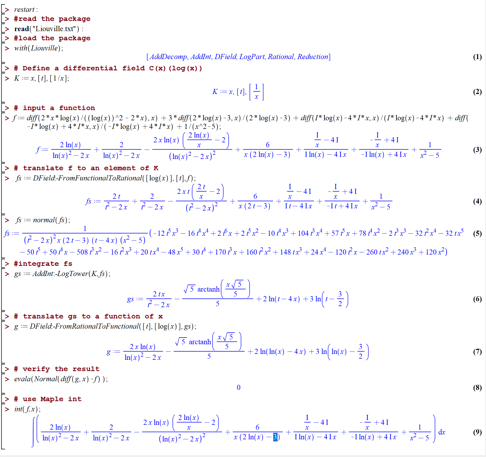
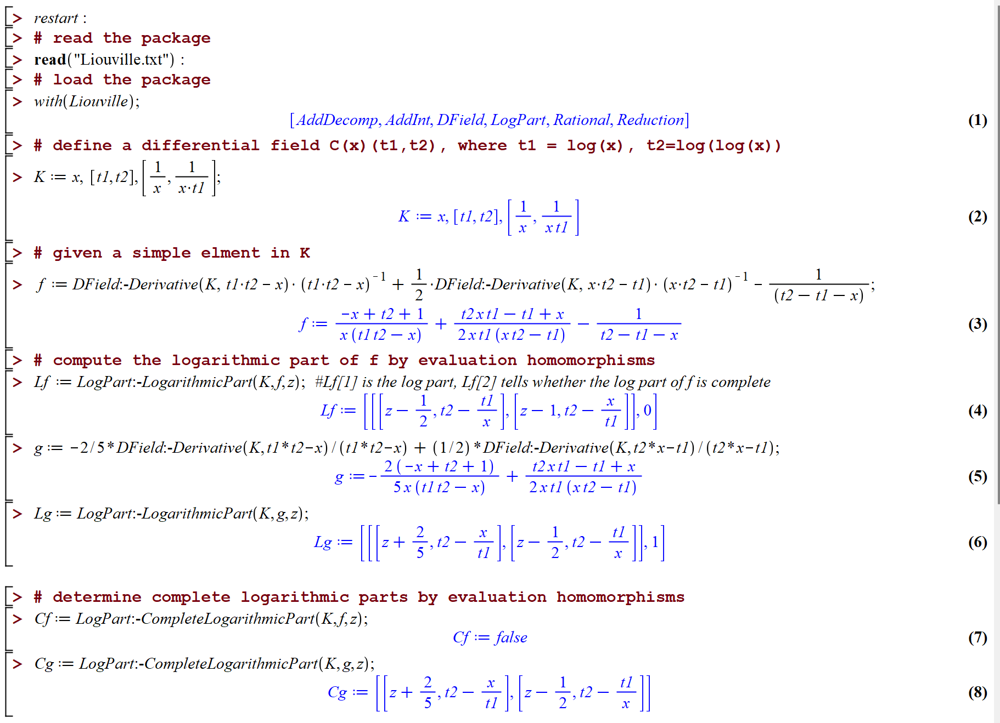
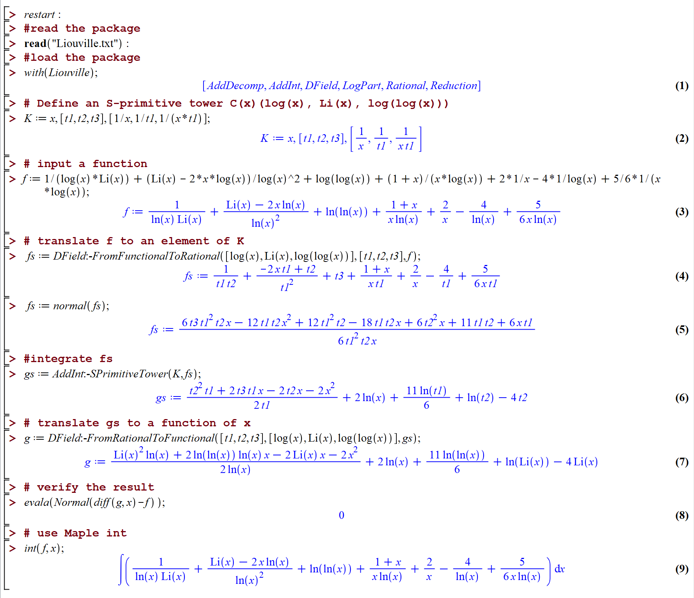

---
title: 'Computing Logarithmic Parts by Evaluation Homomorphisms'
share: false
# Authors
# If you created a profile for a user (e.g. the default `admin` user), write the username (folder name) here
# and it will be replaced with their full name and linked to their profile.
authors:
  - admin
  - Yiman Gao
  - Jing Guo
  - Ziming Li

# Author notes (optional)
author_notes:
  - 'Equal contribution'
  - 'Equal contribution'
  - 'Equal contribution'
  - 'Equal contribution'

date: '2023-07-01T00:00:00Z'
doi: ''

# Schedule page publish date (NOT publication's date).
publishDate: '2023-01-01T00:00:00Z'

# Publication type.
# Legend: 0 = Uncategorized; 1 = Conference paper; 2 = Journal article;
# 3 = Preprint / Working Paper; 4 = Report; 5 = Book; 6 = Book section;
# 7 = Thesis; 8 = Patent
publication_types: ['1']

# Publication name and optional abbreviated publication name.
publication: In *Proceedings of ISSAC'23*
#publication_short: In *Proceedings of {ISSAC}'23*

abstract: We present two evaluation-based algorithms, one for computing logarithmic parts and the other for determining complete logarithmic parts in transcendental function integration. Empirical results illustrate that the new algorithms are markedly faster than those based respectively on resultants, contraction of ideals, subresultants and Gröbner bases. They may speed up Risch’s algorithm for transcendental integrands, and help us to compute elementary integrals over logarithmic towers efficiently.

# Summary. An optional shortened abstract.
summary: TODO add

tags: []

# Display this page in the Featured widget?
featured: false

# Custom links (uncomment lines below)
# links:
# - name: Custom Link
#   url: http://example.org

url_pdf: 'http://www.mmrc.iss.ac.cn/~zmli/ISSAC2023/ISSAC2023.pdf'
url_code: 'https://github.com/haodu007/LogPart'
url_dataset: 'https://github.com/haodu007/LogPart/tree/main/experiments'
#url_dataset: 'https://github.com/wowchemy/wowchemy-hugo-themes'
#url_poster: ''
#url_project: ''
#url_slides: ''
#url_source: 'https://github.com/wowchemy/wowchemy-hugo-themes'
#url_video: 'https://youtube.com'

# Featured image
# To use, add an image named `featured.jpg/png` to your page's folder.
#image:
#  caption: 'Image credit: [**Unsplash**](https://unsplash.com/photos/pLCdAaMFLTE)'
#  focal_point: ''
#  preview_only: false

# Associated Projects (optional).
#   Associate this publication with one or more of your projects.
#   Simply enter your project's folder or file name without extension.
#   E.g. `internal-project` references `content/project/internal-project/index.md`.
#   Otherwise, set `projects: []`.
projects:
  - []

# Slides (optional).
#   Associate this publication with Markdown slides.
#   Simply enter your slide deck's filename without extension.
#   E.g. `slides: "example"` references `content/slides/example/index.md`.
#   Otherwise, set `slides: ""`.
slides: ""
--------
## LogInt
Given an elementary integrable element in a logarithmic tower, for example,  $\mathbb{C}(x, \log(x))$ , the Algorithm **AddInt_log** can find its elementary integral, while **int** in Maple can only return the input without computing.

## LogPart
Given an element in a logarithmic tower, for example, in  $\mathbb{C}(x, \log(x), \log(\log(x)))$ , the Algorithm **EH** and Algorithm ** EH$^*$ ** can compute its logarithmic part and the complete logarithmic part, respectively.

## SprimInt
By an analogue of Algorithm **AddInt_log**, we can also find elementary integrals for elements in S-primitive towers while Maple **int** cannot.

{}
click the  _PDF_  button to download the paper.
{}

{}
click th  _Code_  button to get maple code link(in github).
{}

{}
click th  _Dataset_  button to get experiments in the paper(in github).
{}